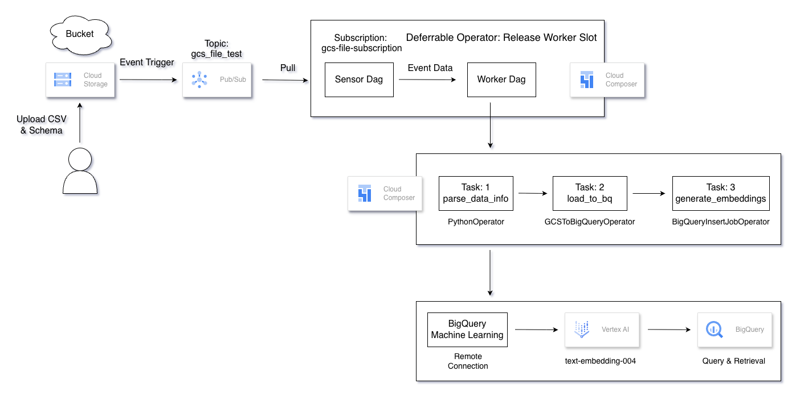

### 背景
本次工作坊主要想法為對資料時效性與自動化的需求。過去的作業模式下，上傳結構化或非結構化數據至雲端時，需仰賴人工監控存儲狀態，並以手動觸發後續的轉檔與分析腳本。
此方式易導致數據處理延遲與資料遺漏風險。此外，在並發處理任務時，傳統工作流的資源分配瓶頸往往成為擴展障礙。故實作將以事件驅動架構 (Event-Driven)
，利用雲端原生的自動化機制，來確保運算與存儲事件達成即時同步。


### 工具說明

- Python 
- Google Cloud Platform (Cloud Storage, Composer, PubSub, BigQuery, VertexAI, BigQuery ML)


### 架構圖



### 流程說明
本實作採用監控與執行分離的架構，分成偵測 `Sensor DAG` 與資料處理 `Worker DAG` 兩個模式 ，確保流程的可用與擴展性。

1. Sensor DAG (sensor_dag_gcs)

    - 專注於外部事件，整合 Pub/Sub 服務，利用 `PubSubPullSensor` 對訂閱項目的即時監控。當偵測到 GCS 有新檔案產生的訊息時，會一次性抓取最多 10 則訊息，並將這些訊息封裝後傳遞給下游。

2. Worker DAG (worker_dag_processing)

    - 負責處理實際的資料轉換與載入。被 `Sensor DAG` 觸發啟動，從 dag_run.conf 中取出訊息內容，並根據訊息中的檔案路徑進行處理。主要透過 `TriggerDagRunOperator` 將 Pub/Sub 攜帶的事件資料送入 `Worker DAG`。


### 什麼是 Worker Slot？
Airflow 的 Worker 是執行任務的地方。為了不讓 Worker 超載，系統會限制每個 Worker 同時能處理的任務數量，每一個任務佔用的位置就稱為一個 Slot。假設 Worker 只有 8 個 Slots，這代表它同時只能處理 8 個任務，以下舉例說明一般 Sensor 的「佔位」問題 。

    - 動作：工人（Worker）進入工位（Slot），開始打電話問：「資料來了沒？」

    - 頻率：如果資料沒來，工人不會離開，而是坐在工位上發呆（Sleep），等 30 秒後再問一次。

    - 結果：即使工人只是在「等」，他也死死佔住了那個工位。

這導致了資源浪費： 如果任務需要等 2 小時資料才會來，這 2 小時內，那個 Slot 就是停擺的狀態，其他真正需要運算的任務進不來。假設這種 Sensor 多開幾個，Airflow 就算沒在做事，也會因為工位滿了而無法執行任何新任務。


### 限制
為了避免上述長時間佔用 Worker slot 問題，本實作在 `PubSubPullSensor` 參數中，設定 `deferrable = True`，此功能將等待任務移交給 Airflow Triggerer 處理。
這代表在等待 Pub/Sub 訊息傳入的過程中，不會消耗任何 Worker 運算資源，極大化系統的可用性。


### Deferrable Mode

提交監控：Sensor 啟動，告訴系統：要監控這個 PubSub 訂閱。

釋放工位 (Suspend)：Sensor 交出 Slot，工人（Worker）可以去處理其他的資料轉換或運算任務。

交給 Triggerer：監控的工作移交給了一個組件叫 Triggerer。這個組件專門用來處理非同步的等待，一個 Triggerer 可以同時監控成千上萬個任務。當 Pub/Sub 真的有訊息進來時，Triggerer 會發訊號給 Airflow：「資料來了，請重新分配一個 Slot 給這個任務繼續執行。


### 程式說明
worker_dag_processing 主要包含三個主要任務：

1. parse_data_info (PythonOperator)

    - 解析外部觸發傳入的 PubSub 訊息。

    - 從 dag_run.conf 中取出訊息，進行 Base64 解碼與 JSON 解析，從中提取檔案所在的 bucket 名稱與檔案 name。

2. load_to_bq (GCSToBigQueryOperator)

    - 將檔案從 GCS 載入到 BigQuery 暫存表。

    - 利用 XCom 動態接收上一個任務解析出來的檔案路徑，並使用 WRITE_APPEND 模式存入 incoming_files-2 資料表，開啟 autodetect 自動辨識欄位格式。

3. generate_embeddings (BigQueryInsertJobOperator)

    - 利用 BigQuery ML 產生資料向量 (Embedding)。

    - 將評論資料（評分、產品ID、摘要、內容）組合成一個長字串 content。

    - ML.GENERATE_EMBEDDING 函式，搭配指定的模型（如 Vertex AI 的嵌入模型）。將產生的向量資料存入最終表 embedded_table_2，供後續語意搜尋或 RAG 應用使用。


### 實做

```bash
git clone https://github.com/JeWeiLin/data-workshop.git

pip3 install -r requirements.txt
```


- 設定 Cloud Platform 專案

```bash
gcloud config set project <your-project-ID>
```
<br>
<br>

- 在 Cloud Storage 中建立一個儲存桶，作為存放資料的地方。

```bash
gcloud storage buckets create gs://your-bucket-name --location=asia-east1
```   
<br>
<br>

- 在 PubSub 中建立名為 gcs-file-topic 的主題 (Topic, e.g. gcs-file-topic)

```bash
gcloud pubsub topics create your-pubsub-topic
```  
<br>
<br>

- 建立訂閱 (Subscription)，讓服務可以接收訊息 (e.g. gcs-file-subscription)

```bash
gcloud pubsub subscriptions create your-pubsub-subscription \
    --topic=your-pubsub-topic \
    --ack-deadline=80
```  
<br>
<br>

- 建立 GCS 通知連結 (Notification) ，讓 GCS 在檔案變動時主動發訊息給 PubSub。

```bash
gcloud storage buckets notifications create gs://your-bucket-name \
    --topic=your-pubsub-topic \
    --event-types=OBJECT_FINALIZE
```
<br>

OBJECT_FINALIZE: 代表只有 `新檔案上傳成功` 或 `覆蓋檔案` 時才會發通知。
若有出現 kind: storage#notification 和 id: '1'，代表已經成功建立了 GCS 與 PubSub 之間的通知連結 (Notification) 。


- 建立 Composer 環境 